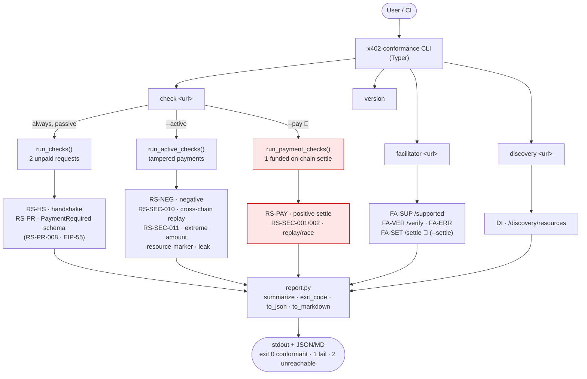
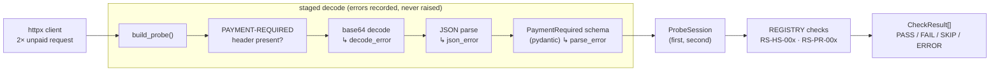
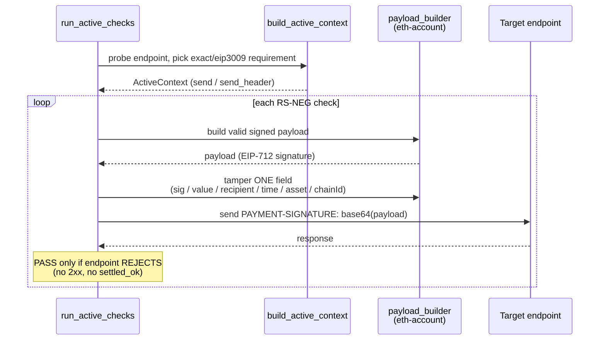
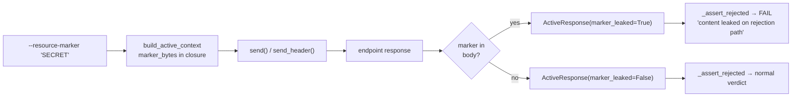
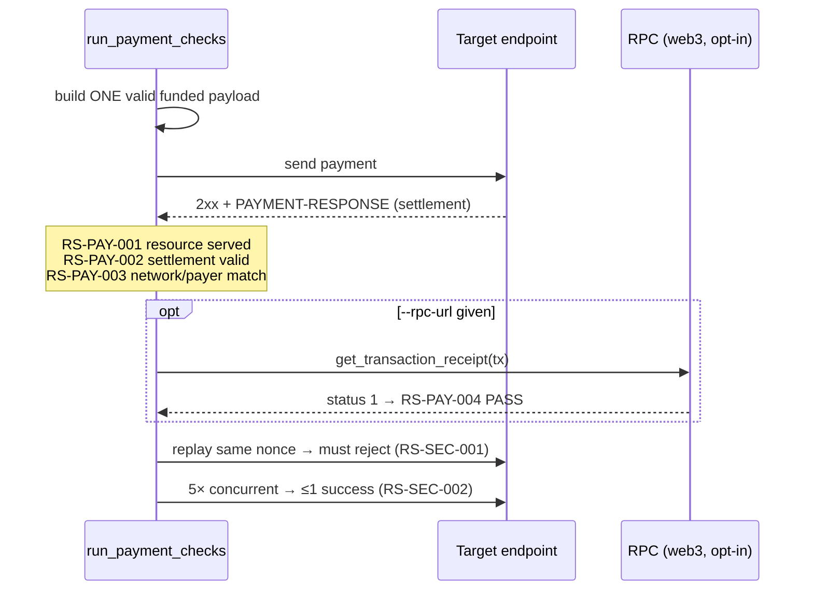
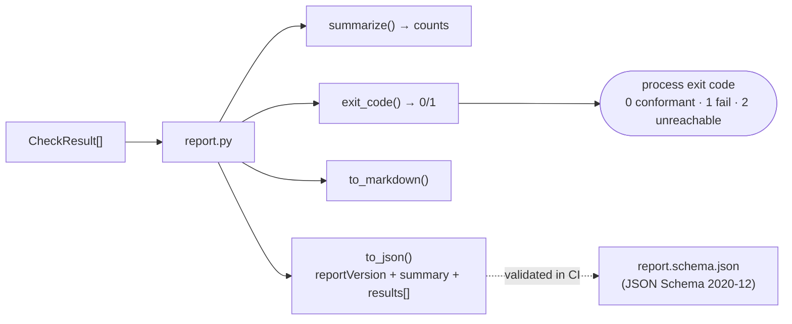
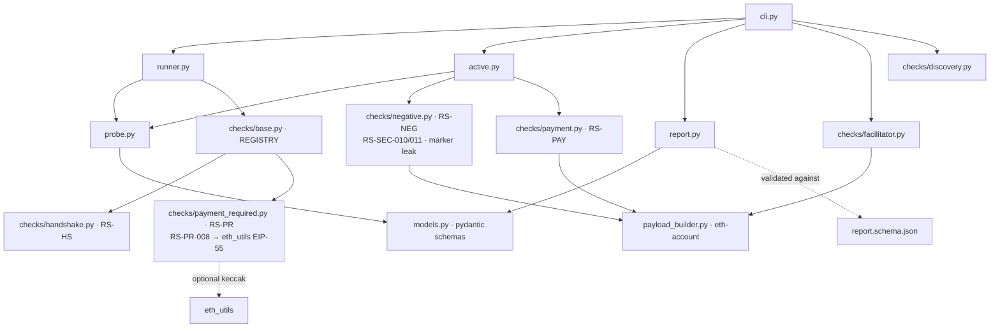

# Architecture — how x402-conformance works

Black-box conformance tester for [x402](https://github.com/x402-foundation/x402) V2
endpoints. You point it at a URL; it probes the endpoint, evaluates a catalog of
spec-traceable checks, and emits a verdict + report. Every check carries an ID,
severity, and a spec reference (see [`conformance-catalog.md`](conformance-catalog.md)).

## 1. The big picture — commands and check groups

`💸` = moves real funds → testnet/Anvil only, opt-in behind an explicit flag.

## 2. Passive check pipeline (`check`, no payment)

Two unpaid requests are made, then each response is *pre-digested* in stages so a
check can pinpoint the exact failure layer (bad base64 vs. bad JSON vs. schema).

Key design rule: **a check never raises on bad endpoint behavior** — it returns
`FAIL`/`SKIP` with a detail string. A crash is classified `ERROR` and treated as a
bug in the suite, never the target's fault.

## 3. Active negative pipeline (`check --active`)

Signs a *valid* EIP-3009 `TransferWithAuthorization`, then mutates exactly one
field per test so the endpoint is forced to reject for one specific reason.

Independence guarantee: signing is built directly on `eth-account`, **not** the
x402 SDK — so the tester can't inherit the SDK's bugs. The SDK is used only as a
test-time oracle (the EIP-712 digest is asserted byte-identical in the unit tests).
Throwaway random signer by default; no funds, no chain needed.

The same pipeline also runs two robustness/security checks that don't fit the
"tamper one field" mould:

- **RS-SEC-010** — signs for a *different* `chainId` (`eip155:1`) but submits to
  this endpoint; EIP-712 binds chainId in the domain, so recovery must fail.
- **RS-SEC-011** — signs a `2²⁵⁶-1` (uint256 max) amount. The tool must sign it
  without overflow and the endpoint must reject it *cleanly* — a `5xx` here means
  the endpoint crashed on a huge value (FAIL), not that it validated it.

### 3a. Content-leak detection on the rejection path (`--resource-marker`)

Every active check already fails an endpoint that *serves* the resource (2xx) or
reports a successful settlement for an invalid payment. `--resource-marker`
strengthens this: it catches an endpoint that correctly returns a non-2xx **but
still leaks the protected content in the error body**.

Design choice: the leak is detected **once, centrally**, at response-build time
inside the `send`/`send_header` closures (which already hold the marker in
scope), and exposed as a single `marker_leaked` flag on `ActiveResponse`. So all
~11 negative checks gain leak detection without touching a single call site —
`_assert_rejected` just reads the flag.

## 4. Positive settlement pipeline (`check --pay` 💸)

All assertions share a **single** settlement (one nonce, one on-chain tx) so the
group never spends per-check.

## 5. Report output contract (versioned JSON)

Every command funnels its `CheckResult[]` through `report.py`, which produces the
terminal summary, the CI exit code, an optional Markdown report, and an optional
**machine-readable JSON report** whose shape is a pinned contract.

The JSON carries a top-level `reportVersion` (currently `1.0`). `report.schema.json`
at the repo root is the published contract — `additionalProperties: false`,
`severity`/`status` constrained to enums — and the test suite validates real
output against it, so any accidental shape drift fails CI. Consumers pin a major
version of `reportVersion`.

| Field | Meaning |
|-------|---------|
| `reportVersion` | Schema version of this report shape (`MAJOR.MINOR`). |
| `tool` | `{name, version}` of the tester. |
| `specBaseline` | Pinned x402 spec snapshot the checks target. |
| `target` | The tested endpoint / base URL. |
| `timestamp` | UTC ISO-8601 generation time. |
| `summary` | `{total, passed, failed, skipped, errors}`. |
| `conformant` | `true` when no critical/major check failed/errored. |
| `results[]` | One `{check_id, title, severity, spec_ref, status, detail}` per check. |

## 6. Module map

The `[evm]` extra (eth-account, eth-utils) is only needed for `--active`/`--pay`,
the facilitator `/verify` negatives, and RS-PR-008's EIP-55 checksum validation;
the `[onchain]` extra (web3) only for RS-PAY-004. The passive core stays
dependency-light and chain-free — RS-PR-008 falls back to a format-only check
when keccak isn't installed, so the core never hard-depends on it.
