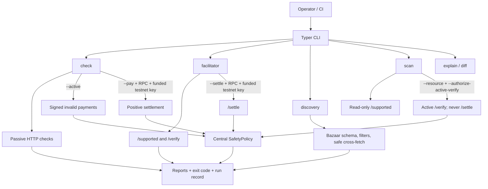
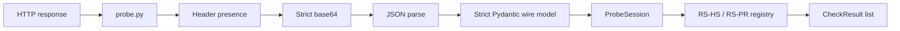

# Architecture

`x402-conformance` is a black-box tester for x402 HTTP resource servers,
facilitators, and Bazaar discovery endpoints. Every emitted result has a stable
ID, severity, specification reference, and explicit implementation status in the
[conformance catalog](conformance-catalog.md). The exact coverage boundary lives
in the [support matrix](support-matrix.md).

## Commands and trust boundaries



Payment-bearing requests do not follow redirects. Before any payload is built,
`SafetyPolicy` rejects mainnets and unknown networks. Positive resource or
facilitator settlement additionally reads `eth_chainId` from the RPC and requires
an exact match with the advertised CAIP-2 network. Transactional modes cannot be
enabled by auto-discovered configuration.

## Passive resource pipeline

`runner.run_checks()` sends two unpaid requests using exactly the operator-selected
HTTP method. It never switches GET and POST. Transient 429/5xx responses are
retried; a persistent infrastructure failure is `EndpointUnreachable`, not a
target conformance failure.



Parsing is staged so malformed endpoint data becomes a precise FAIL or SKIP.
Unknown future fields remain allowed where the wire contract permits them, while
booleans, integers, timeouts, and response types are never coerced from strings.
Resource identity binds scheme, normalized host/effective port, path, and query.

## Active negative pipeline

`build_active_context()` selects a supported `exact` EVM/EIP-3009 requirement,
preserves the advertised `resource` and `extensions`, and constructs a throwaway
signer unless the operator supplied one. Each semantic negative is built with the
invalid value first and then signed. Tests assert that the resulting signature
still recovers to the authorizer, ensuring the target is testing the intended
amount/recipient/time/asset condition rather than merely rejecting a broken
signature.

```mermaid
sequenceDiagram
    participant R as active runner
    participant S as SafetyPolicy
    participant B as payload builder
    participant E as endpoint
    R->>S: validate advertised network
    S-->>R: allowlisted testnet/local
    loop each RS-NEG / RS-SEC case
        R->>B: build semantic-invalid value and sign it
        B-->>R: complete V2 payload with resource/extensions
        R->>E: one payment-bearing request, redirects disabled
        E-->>R: response
        Note over R: 4xx/402 rejection can PASS; transport, 5xx, malformed settlement, content leak, or success cannot
    end
```

All active registries use the shared duplicate-ID guard. `--concurrency` changes
execution only; result order remains catalog order. The runnable active mechanism
is deliberately limited to EIP-3009; SVM foundations are not represented as a
runnable verdict.

## Positive settlement proof

Positive checks fail closed on RPC availability and payer balance. A successful
endpoint response is not sufficient evidence. The tool validates the strict
settlement response and then proves:

- canonical transaction hash and successful receipt;
- matching chain/network;
- expected token contract;
- exactly one unambiguous ERC-20 `Transfer` from payer to `payTo` for the exact amount.

An unrelated successful transaction, wrong token/recipient/value, reverted
transaction, missing log, or duplicate matching events cannot PASS. Facilitator
`FA-SET-001` calls the same verifier when an RPC is supplied and returns SKIP when
on-chain proof is unavailable.

## Facilitator and discovery

Facilitator `/supported`, `/verify`, and `/settle` responses use strict wire
models. Transport failures propagate to command orchestration as exit 2; missing,
non-JSON, 3xx/5xx, or type-invalid responses never prove correct rejection.
`tools/onchain_facilitator.py` verifies signatures and simulates the token call
without changing state before `/verify` returns true.

Discovery validates the complete resource and pagination schemas and exercises
all current filters. DI-003 treats listed resource URLs as hostile input:

- schemes, userinfo, host/IP/CIDR allowlists, and redirect targets are validated;
- every DNS answer must be public unless explicitly allowlisted;
- the connected address is pinned to the validated answer;
- HTTPS downgrades, unsafe redirects, oversized bodies, too many pages/resources,
  and excessive cross-fetches fail closed or remain explicitly inconclusive.

## Verdicts, reports, and traceability

The central `assessment_exit_code()` contract is:

| Exit | Meaning |
|---|---|
| `0` | The supported assessment is conformant; no critical/major FAIL and no ERROR. |
| `1` | Not conformant, or any suite ERROR occurred. |
| `2` | Inconclusive/unreachable/invalid input; includes empty/all-SKIP and V1-only V2 assessments. |

JSON report version `1.1` is validated by `report.schema.json`. JSON, Markdown,
SARIF, developer reports, scans, and default run records use the same verdict.
Persisted targets are reduced to their origin plus a stable SHA-256 fingerprint;
userinfo, paths, queries, fragments, and URL-bearing exception text are sanitized.
Run records have a self-contained integrity checksum for accidental-change
detection, not an adversarial trust anchor.

## Module map

| Module | Responsibility |
|---|---|
| `cli.py` | Typed configuration, consent gates, command exit/error handling. |
| `safety.py` | Network/RPC allowlist and no-mainnet/no-redirect policy. |
| `runner.py`, `probe.py`, `models.py` | Passive request orchestration and strict wire parsing. |
| `active.py`, `payload_builder.py` | EIP-3009 context, signing, payload/resource/extension binding. |
| `checks/*` | Passive, active, payment, facilitator, discovery, and timing verdicts. |
| `svm.py` | Non-runnable SVM foundation: CAIP-2, ATA, partial transaction, tamper helpers. |
| `jp402.py` | Optional structural JP metadata checks with hostile-number limits. |
| `report.py`, `redaction.py`, `run_record.py` | Verdict, formats, sanitization, trace records. |
| `diff.py`, `scan.py` | Strict report comparison and redacted batch aggregation. |

Optional dependencies remain isolated: `[evm]` supplies signing/checksum support,
`[onchain]` supplies EVM receipt proof, and `[svm]` supplies the foundation
builder. See [supply-chain.md](supply-chain.md) for the reproducible full gate.
