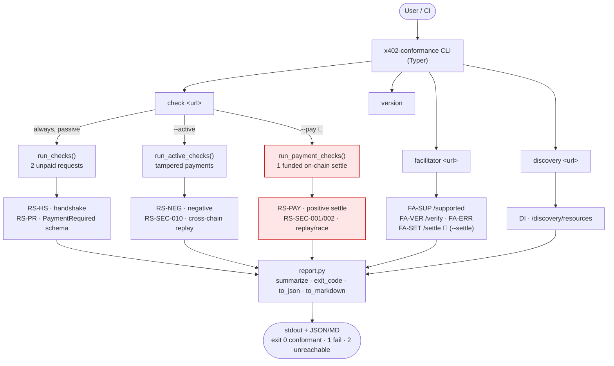
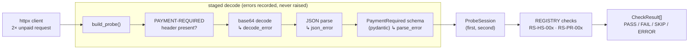
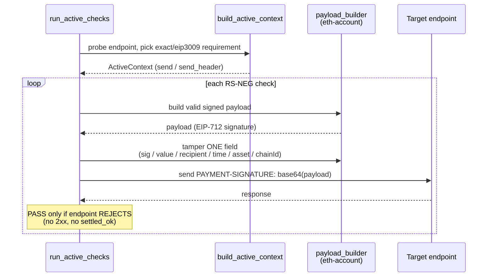
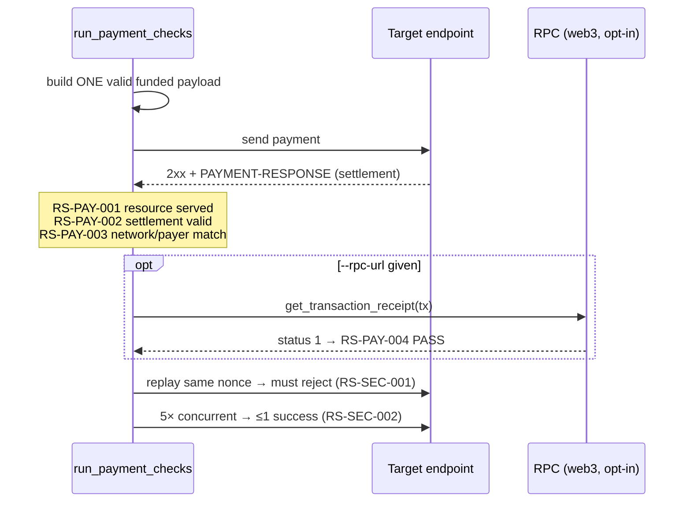
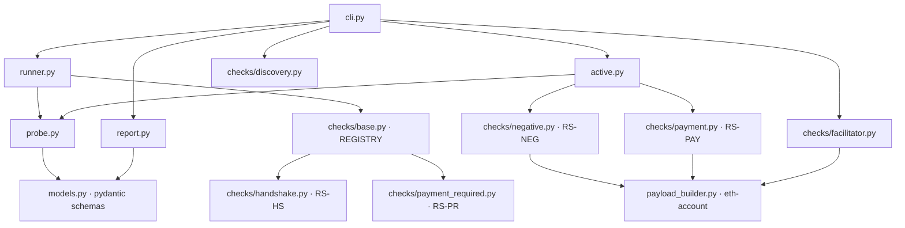

# Architecture — how x402-conformance works

Black-box conformance tester for [x402](https://github.com/x402-foundation/x402) V2
endpoints. You point it at a URL; it probes the endpoint, evaluates a catalog of
spec-traceable checks, and emits a verdict + report. Every check carries an ID,
severity, and a spec reference (see [`conformance-catalog.md`](conformance-catalog.md)).

## 1. The big picture — commands and check groups

`💸` = moves real funds → testnet/Anvil only, opt-in behind an explicit flag.

## 2. Passive check pipeline (`check`, no payment)

Two unpaid requests are made, then each response is *pre-digested* in stages so a
check can pinpoint the exact failure layer (bad base64 vs. bad JSON vs. schema).

Key design rule: **a check never raises on bad endpoint behavior** — it returns
`FAIL`/`SKIP` with a detail string. A crash is classified `ERROR` and treated as a
bug in the suite, never the target's fault.

## 3. Active negative pipeline (`check --active`)

Signs a *valid* EIP-3009 `TransferWithAuthorization`, then mutates exactly one
field per test so the endpoint is forced to reject for one specific reason.

Independence guarantee: signing is built directly on `eth-account`, **not** the
x402 SDK — so the tester can't inherit the SDK's bugs. The SDK is used only as a
test-time oracle (the EIP-712 digest is asserted byte-identical in the unit tests).
Throwaway random signer by default; no funds, no chain needed.

## 4. Positive settlement pipeline (`check --pay` 💸)

All assertions share a **single** settlement (one nonce, one on-chain tx) so the
group never spends per-check.

## 5. Module map

The `[evm]` extra (eth-account) is only needed for `--active`/`--pay` and the
facilitator `/verify` negatives; the `[onchain]` extra (web3) only for RS-PAY-004.
The passive core stays dependency-light and chain-free.
